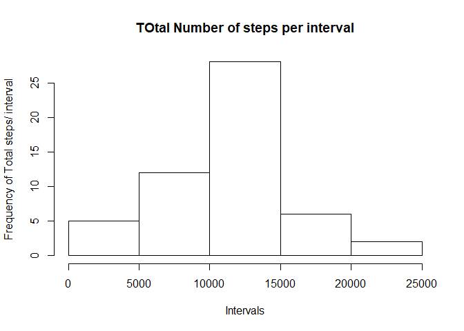
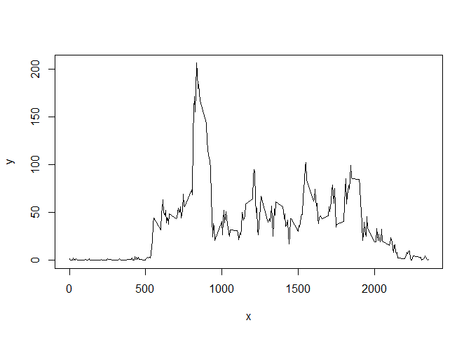
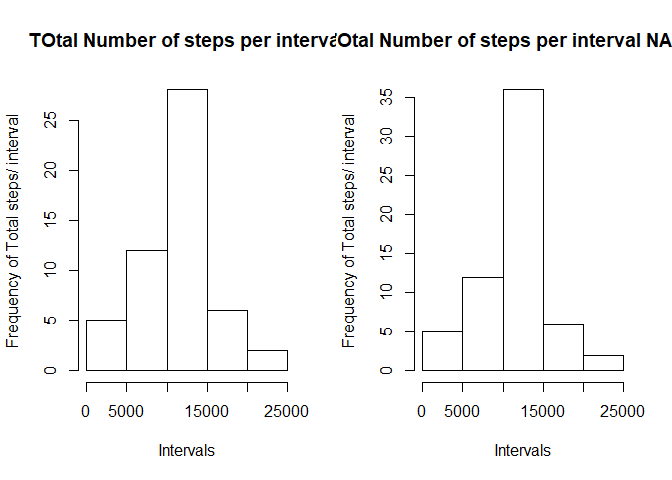
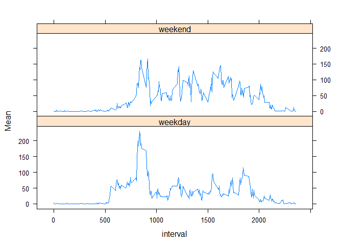

## Loading and preprocessing the data


```r
library("dplyr")
```

```
## 
## Attaching package: 'dplyr'
```

```
## The following objects are masked from 'package:stats':
## 
##     filter, lag
```

```
## The following objects are masked from 'package:base':
## 
##     intersect, setdiff, setequal, union
```

```r
library(lattice)
```

```
## Warning: package 'lattice' was built under R version 3.6.2
```

```r
activity       <- ( read.csv('activity.csv',sep=',') )
act_clean      <- activity[!is.na(activity['steps']),] # activity[!is.na(activity[,'steps']),]
act_clean$date <- as.character(act_clean$date)
```

## What is mean total number of steps taken per day?

```r
sum_day        <- tapply(act_clean$steps,act_clean$date,sum)
hist(as.integer(sum_day),xlab = "Intervals", ylab = "Frequency of Total steps/ interval", main = " TOtal Number of steps per interval ")
```

<!-- -->

```r
day_stats        <- as.data.frame(tapply(act_clean$steps,act_clean$date,mean))
names(day_stats) <- c("Mean")
day_stats$median <- tapply(act_clean$steps,act_clean$date,median)
day_stats$Total  <- tapply(act_clean$steps,act_clean$date,sum)

print('Calculate and report the Mean and Median total number of steps taken each day')
```

```
## [1] "Calculate and report the Mean and Median total number of steps taken each day"
```

```r
Est.mean <- c(mean(day_stats$Total))
Est.median <- c(median(day_stats$Total))
df_results <-data.frame(Est.mean,Est.median)
row.names(df_results) <- c('NA removed')
df_results
```

```
##            Est.mean Est.median
## NA removed 10766.19      10765
```

## What is the average daily activity pattern?

```r
avg_interval        <- as.data.frame(tapply(act_clean$steps,act_clean$interval,mean)) #<--------tiene la media cada intervalo de tiempo
names(avg_interval) <- c("Mean")
avg_interval$interval  <- as.numeric(rownames(avg_interval)) 
x                   <- as.integer(row.names(avg_interval))
y                   <- avg_interval$Mean
plot(x,y,type='l')
```

<!-- -->

```r
print('Interval with hightest with maximun number of points')
```

```
## [1] "Interval with hightest with maximun number of points"
```

```r
rownames(avg_interval)[which.max(apply(avg_interval,MARGIN=1,max))]
```

```
## [1] "2355"
```

## Imputing missing values

```r
print('Number of missing values')
```

```
## [1] "Number of missing values"
```

```r
sum(is.na(activity['steps'])) 
```

```
## [1] 2304
```

```r
# act_filled <- activity
# for (row in 1:nrow(act_filled)){
#   if ( is.na(act_filled[row,'steps']) ){
#     act_filled[row,'steps'] = avg_interval  [as.character(act_filled[row,'interval']),]   
#   }
# }


act_filled <- merge(activity,avg_interval,by.x='interval')
act_filled <- mutate(act_filled,steps= ifelse(is.na(steps),Mean,steps))

sum_day_complete<- tapply(act_filled$steps,act_filled$date,sum)

par(mfrow = c(1,2))

hist(as.integer(sum_day),xlab = "Intervals", ylab = "Frequency of Total steps/ interval", main = " TOtal Number of steps per interval ")
hist(as.integer(sum_day_complete),xlab = "Intervals", ylab = "Frequency of Total steps/ interval", main = " TOtal Number of steps per interval NA filled ")
```

<!-- -->

```r
day_stats_filled        <- as.data.frame(tapply(act_filled$steps,act_filled$date,mean))
names(day_stats_filled) <- c("Mean")
day_stats_filled$median <- tapply(act_filled$steps,act_filled$date,median)
day_stats_filled$Total  <- tapply(act_filled$steps,act_filled$date,sum)

print('Calculate and report the Mean and Median total number of steps taken each day')
```

```
## [1] "Calculate and report the Mean and Median total number of steps taken each day"
```

```r
df_results['NA filled','Est.mean'] <-mean(day_stats_filled$Total)
df_results['NA filled','Est.median'] <-median(day_stats_filled$Total)
df_results
```

```
##            Est.mean Est.median
## NA removed 10766.19   10765.00
## NA filled  10766.19   10766.19
```
## Are there differences in activity patterns between weekdays and weekends?

```r
act_filled    <- mutate(act_filled, dia = ifelse (weekdays(as.Date(act_filled$date)) %in% c('sábado','domingo'),'weekend', 'weekday')    )

activity_week <- split(act_filled,act_filled$dia)
weekday       <- activity_week$weekday 
weekend       <- activity_week$weekend
avg_interval_weekday <- as.data.frame(tapply(weekday$steps,weekday$interval,mean)) 
avg_interval_weekend <- as.data.frame(tapply(weekend$steps,weekend$interval,mean)) 

names(avg_interval_weekday) <- c("Mean")
names(avg_interval_weekend) <- c("Mean")
avg_interval_weekday$day = 'weekday'
avg_interval_weekend$day = 'weekend'

avg_interval_weekday$interval <- as.numeric(row.names( avg_interval_weekday))
avg_interval_weekend$interval <- as.numeric(row.names( avg_interval_weekend))

avg_interval_plot <- rbind(avg_interval_weekday,avg_interval_weekend)

xyplot(Mean ~ interval | day, data=avg_interval_plot,type='l',layout=(c(1,2)))
```

<!-- -->
